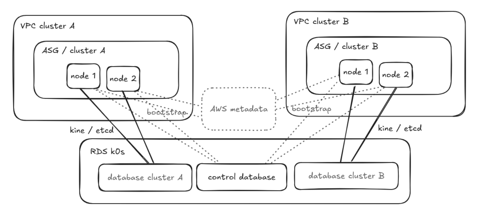

# cluster_k0s

This Ansible role automates the deployment and management of a k0s Kubernetes cluster on AWS. k0s is a lightweight, certified Kubernetes distribution that simplifies cluster operations. With the help of k0s it is possible to create very small clusters whereas the controller and workloads are running on the very same hosts.

In such distributed clusters the most crucial question in etcd high-availability. This is handled in a very simple way on this platform: etcd is hosted on an AWS RDS Postgres instance with the help of [kine](https://github.com/k3s-io/kine/tree/master). This approach drastically simplifies cluster operations. Clusters can be totally shut-down (including controllers and workers) and brought back from the Postgres database.



The aim is to create self-contained cluster nodes that can be:

- controllers and worker nodes at the same time,
- and part of a single autoscaling group bootstrapped over pure AWS cloud init / user data. 

(Besides etcd, there is only minor cluster information kept in Postgres: join tokens and CA certificates.)

This is a PoC level implementation, ie. it uses on-boot bootstrapping which might not be suitable in all use cases.

## What is is good for?

- HA cluster playground, very simple setup with minimal management overhead: something between minikube and an full fledged EKS/GKS/AKS cluster provided by a cloud provider 
- Edge use cases (it is a different question if Postgres is available on the edge)
- When large amount of smaller clusters are required due to network fragmentation
- Temporary clusters, dev or CI/CD environments
- Cost efficiency/scaling: EKS 70USD/mo for one cluster vs. RDS starting from 15USD/mo for multiple clusters

## Prerequisites

*   An AWS account.
*   Ansible installed on your control machine.
*   AWS credentials configured for Ansible (e.g., using environment variables or an AWS credentials file).
*   A VPC or subnet IDs where the cluster will be deployed.
*   An RDS database to host cluster etcd and basic controller information. The schema of the central database can be found in files/k0s_db.sql

### Configuration variables:

Modify the `group_vars/all.yml` or `inventory` file to set the required variables, such as:

* `aws_account`: Your AWS account ID.
* `aws_profile`: The AWS profile to use for the deployment
* `region`: The AWS region for deployment.
* `vpcID` or `subnet_ids`: The VPC ID or subnet IDs for the cluster.
* `auth_zone_id`: The authoritative zone id.
* `aws_profile_auth_dns`: The AWS profile to manage the authoritative zone for the cluster.
* `default_tags`: The default tags for the resources.
* `instance_type`: The instance type for the worker nodes (default t3a.small)
* `cluster_dns_zone`: 
* `psql_controller`: PgSQL server to host etcd and controller DB 
* `psql_user`: user to access PgSQL server
* `psql_controller_pass`: password to access PgSQL server
* `psql_db`: controller database

Note: most of the naming is derived from `inventory_hostname`, set something sensible.

An example host entry in the inventory: 

```yaml
---
vpc:
  hosts:
    play_proxy_xx:
      vpc_name: play-proxy-xx
      cluster_name: play-proxy-xx
      vpcID: vpc-060b3**********
      env: nonprod
      aws_account: '699*************'
      region: eu-central-1
      description: 'Playground new proxy infra'
      cidr_size: 24
      private_subnet_desired_size: 26
      public_subnet_desired_size: 26
      subnets:
      - az: eu-central-1b
      - az: eu-central-1a
      - az: eu-central-1c
      - az: eu-central-1b
        type: public
      cluster_dns_zone: k0s.example.com
```
    
## Ansible Features

### Infrastructure Provisioning

*   Creates IAM roles for the k0s cluster and worker nodes.
*   Sets up security groups for cluster traffic.
*   Creates VPC endpoints for SSM.
*   Defines a launch template for worker nodes (including spot instance support).
*   Creates an Auto Scaling Group (ASG) for worker node management.
*   Handles subnet and vpc information.
*   Finds the latest ubuntu minimal ami.
## k0s Cluster Configuration

*   Uses cloud-init to configure instances.
*   Installs necessary packages.
*   Sets up a `k` alias for `k0s kubectl`.
*   Deploys the `k0s.yaml` configuration file.
*   Deploys helper scripts for node management, token creation, DNS updates, and spot instance termination handling.
*   Configures a cron job for DNS updates, token creation and node cleanup.
*   Installs and enables the Amazon SSM agent.
*   Installs k0s.
*   Runs k0s node init scripts.

### DNS Management

*   Creates a Route53 hosted zone for the cluster.
*   Creates NS records in an authoritative zone.
*   Creates an IAM policy for DNS zone management.
*   Runs a cron job to update the dns records.
    
## Run the playbook

    ```bash
    ansible-playbook -i inventory deploy_cluster_k0s.yaml -l {{ cluster_name }}
    ```
    You can run the playbook with the tag `implement` to create the resources.

## Files and Structure

*  `tasks/main.yaml`: The main playbook for cluster creation.
*  `templates/user_data.txt.j2`: Cloud-init configuration for instances.
*  `templates/assets/`: Contains k0s configuration and helper scripts.
*  `files/k0s_tokens.sql`: SQL file to create the database tables for tokens and certs; there is no playbook to implement this at the moment

# TODO

- ? Authentication provider for IRSA ~ until that node role can be used to grant AWS access
- ? OIDC AzureAD provider
- Move away from on boot bootstrapping
- more separation on database level, at the moment we presume all clusters are maintained by the same team hence there is no role segregation
# License

MIT


